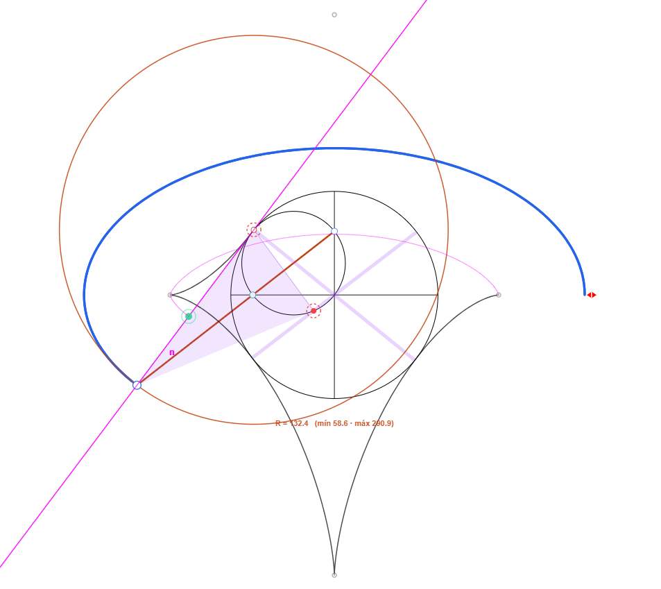

# EllipseLab: Laboratorio Geométrico Interactivo


**EllipseLab** es una plataforma interactiva desarrollada en JavaScript puro para la visualización y estudio de la elipse a través de **39 métodos constructivos y mecanismos históricos**.

## Demo en Vivo
**[Prueba el laboratorio aquí](https://manomaje-cmd.github.io/EllipseLab/)**

---

## 🛠 Modos y Fenomenología Documentada
El laboratorio permite explorar 39 capas distintas, incluyendo:

| Modo | Descripción Técnica |
| :--- | :--- |
| **Afinidad** | Traza la elipse mediante la afinidad persistente entre sus circunferencias. |
| **Antiparalelogramo** | Antiparalelogramo articulado cuyo punto de cruce traza la elipse. |
| **arquimedes_3** | Evolución del compás de Arquímedes que utiliza tres patines articulados en un triángulo rígido. |
| **astroide_envolvente** | Dibuja la elipse mediante un punto vinculado a una vara que desliza por los ejes, envolviendo una astroide. |
| **astroide_hipocicloide** | Genera una astroide mediante una circunferencia de radio (a+b)/4 que rueda por el interior de otra de radio (a+b). |
| **cuadrado** | Construye la elipse mediante una vara guiada por dos circunferencias iguales que recorren los ejes. |
| **circunferencia_afin** | Muestra la elipse como la afinidad proyectiva de una circunferencia mediante un mapeo de cuadrículas. |
| **focal** | Define la elipse como el lugar de los centros de circunferencias que pasan por un foco y son tangentes a la focal del otro. |
| **2focales** | Genera la elipse mediante una familia de circunferencias centradas en su perímetro que pasan por un foco. |
| **dandelin** | Demuestra la elipse como sección cónica mediante las esferas de Dandelin. |
| **delaunay_horiz** | Paralelogramo articulado vinculado a una rueda superior que transforma el movimiento circular en elíptico. |
| **delaunay_vert** | Paralelogramo articulado vinculado a una rueda lateral para ajustar la separación mediante interacción directa. |
| **conjugados** | Construye la elipse a partir de diámetros conjugados, mostrando la dirección de afinidad mediante un triángulo móvil. |
| **orbital** | Explora la dinámica celeste: vector velocidad (tangente), aceleración y el hodógrafo interactivo. |
| **elipse_rodante** | Simula la rodadura exterior de una elipse sobre otra. Traza trayectorias de focos y vértices. |
| **envolvente** | Genera la elipse como la envolvente de sus tangentes basándose en la circunferencia focal. |
| **evolvente** | Representa la evolvente mediante una recta que desenrolla el perímetro de la elipse. |
| **excentricidad** | Lugar geométrico respecto a su directriz. Visualiza la proporción constante e = PF / PD. |
| **fowler** | Mecanismo de dos circunferencias engranadas que transforma rotación en trayectoria elíptica exacta. |
| **circulos** | Envolvente de una familia de circunferencias cuyos centros recorren el eje mayor y son tangentes a la principal. |
| **guiado_oblicuo_davinci** | Construye la elipse con dos opciones de triángulo degenerable y guías orientables. |
| **guiado_oblicuo_proclo** | Construye la elipse mediante guiado oblicuo de una vara con direcciones regulables. |
| **guiado_ortogonal** | Detecta mecanismos de autor (Proclo, Leonardo, van Schooten) con guiado sobre ejes ortogonales. |
| **haces_proyectivos** | Construye la elipse mediante la intersección de rayos sobre un marco deformable tangente. |
| **haces_proyectivos_steiner** | Intersección de rayos sobre un marco deformable de Steiner para explorar densidad de haces. |
| **hipotrocoide1** | Rodadura de un círculo sobre el interior de otro de doble diámetro (Par de Tusi) |
| **hipotrocoide2** | Mecanismo de círculos de Hire para explorar la normal y la elipse como envolvente. |
| **isoperimetrica** | Familia de elipses con el mismo perímetro calculado mediante la aproximación de Ramanujan. |
| **jardinero** | Simulación mediante cuerda de longitud fija (2a) anclada en los focos. |
| **kopp** | Pantógrafo que genera la elipse mediante el giro sincronizado de dos manivelas. |
| **osculatriz** | Analiza la curvatura local, la evoluta (astroide) y genera curvas paralelas (offset) |
| **proporcion_latus** | Relación a/b = b/l, donde el semieje menor es media geométrica entre el mayor y el latus rectum. |
| **rombo_directriz** | Conecta la elipse con sus directrices mediante un "rebote" geométrico en un rombo circunscrito. |
| **steiner_circunelipse** | Elipse de área mínima que pasa por los vértices de un triángulo inscrito. |
| **steiner_inelipse** | Elipse de área máxima inscrita que toca los lados en sus puntos medios. |
| **brianchon** | Teorema dual de Pascal: las diagonales de un hexágono circunscrito se cortan en un punto. |
| **pascal** | Los puntos de intersección de los lados opuestos de un hexágono inscrito son colineales. |
| **van_schooten** | Mecanismo basado en un rombo articulado y una vara deslizante. |
| **waves** | Patrón de interferencia constructiva con suma de radios constante (r1 + r2 = 2a) |


---

## 👨‍💻 Para Desarrolladores (Arquitectura)
El proyecto está diseñado de forma modular. Puedes añadir nuevos modos sin tocar el núcleo (`core.js`).

### Reglas para escribir nuevos modos:
1. Usar la API pública: `draw(ctx, state, H)`.
2. Dibujar en coordenadas de "mundo" (Y hacia arriba).
3. No registrar eventos ni tocar el DOM.

### Plantilla de un modo:
```javascript
ElipseLab.registerMode('mi_modo', (ctx, state, H) => {
    const { a, b } = H.params();
    const t = H.clamp01(state.t);
    // Lógica de dibujo aquí...
});
